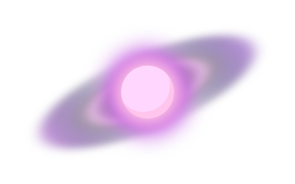

# Andromeda
A simple asset database and loader.
Is simple and super customizable, allowing you to change the loading screen style.

It can load audio files, images and video recursivly

## Usage
Basic usage
```lua
function love.load(args)
    -- importing the library --
    andromeda = require 'andromeda'

    -- initialize a new database --
    assetdb = andromeda.newDB()

    -- queue the search --
    assetdb:queueLoad("assets/images")
    
    -- begin with the importing and displaying the loading screen --
    assetdb:initialize()
end

function love.draw()
    love.graphics.print("All assets loaded", 90, 90)
end
```

## adding a new loading screen
To add a new loading screen, the external file must follow this template:
```lua
return {
    create = function(path)
        -- this function is used to define variables that will be used during the loading screen display --
        -- like images --

        -- the "path" parameter is used internally to get the current path of the library --
        -- it can be ignore by the final user --
    end,
    present = function(progress, max)
        -- this function is used to actually draw the loading content in the screen --
        -- all the images defined by the create function can be used here --
        
        -- the "progress" parameter is used to track the current item count --
        -- the "max" parameter always will return the total item count --
        -- it can be used to create custom progress bars, progress percentage, etc. --
    end
}
```

after creating the file, now you can import it to the loader

```lua
function love.load(args)
    andromeda = require 'andromeda'

    assetdb = andromeda.newDB()

    assetdb:setPreloadScreen("myCustomScreen.lua")

    -- all loading stuff --
end
```

---

Check the demo main.lua file to see the actual use.

# License
This library is free software; you can redistribute it and/or modify it under the terms of the MIT license. See [LICENSE](LICENSE) for details.